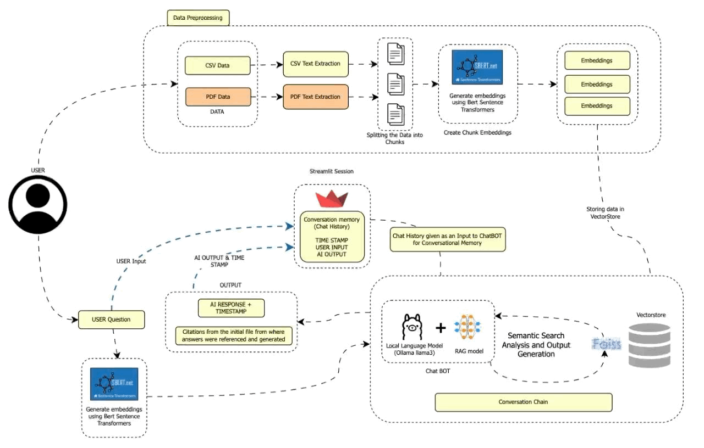

# Content Engine for PDF Analysis and Comparison

## Overview

This project creates a robust Content Engine that analyzes and compares multiple PDF documents, specifically identifying and highlighting their differences. The system leverages Retrieval Augmented Generation (RAG) techniques to effectively retrieve, assess, and generate insights from the documents. Users interact with the system through a chatbot interface, querying information and comparing data across the documents. 

**Note:** This chatbot is completely independent of any external APIs and works entirely locally, ensuring data privacy and security. This utilizes Ollama's llama3 model as a Local Language Model. 

## Key Components
- **Backend Framework: LangChain**
- **Frontend Framework: Streamlit**
- **Vector Store: FAISS**
- **Embedding Model: HuggingFace**
- **Local LLM: Ollama**

## Features

- Local processing ensures data privacy.
- Scalable and modular architecture.
- Interactive Streamlit interface.
- Detailed, contextually rich responses.
- Displays chat history and application logs for transparency.

## Workflow

Here's a visual representation of the application's workflow:



## Setup and Installation

### Prerequisites

- Python 3.8 or higher
- pip

### Installation

1. **Clone the Repository**

    ```bash
    git clone https://github.com/AyonSOMADDAR/Alameno-BOT.git
    cd Alameno-BOT
    ```

2. **Install Dependencies**

    ```bash
    pip install -r requirements.txt
    ```

### Download and Install Ollama

To download and set up Ollama on your PC:

1. **Download Ollama**

    - Visit the [Ollama Download Page](https://ollama.ai/download) and download the appropriate version for your operating system (Windows, macOS, or Linux).

2. **Install Ollama**

    - Follow the installation instructions specific to your operating system:

    **Windows:**

    - Run the downloaded installer and follow the on-screen instructions.

    **macOS:**

    - Open the downloaded `.dmg` file and drag the Ollama app to your Applications folder.

    **Linux:**

    - Extract the downloaded tarball and follow the instructions in the `README` file within the extracted directory.

3. **Verify Installation**

    - Open a terminal or command prompt and run the following command to ensure Ollama is installed correctly:

    ```bash
    ollama --version
    ```

    - You should see the version number of Ollama if the installation was successful.
      
4. **Install llama3 inside Ollama**
    - In the terminal run the following command to install the llama3 model
    ```bash
    ollama pull llama3
    ```

## Usage

1. **Run the Application**

    ```bash
    streamlit run app.py
    ```

2. **Upload PDFs**

    - Use the Streamlit interface to upload multiple PDF files for analysis.

3. **Process PDFs**

    - The system extracts text, splits it into chunks, generates embeddings, and stores them in the FAISS vector store.

4. **Query the System**

    - Enter questions related to the content of the PDFs to retrieve relevant information and generate detailed responses.

5. **View Results**

    - Responses are displayed in the interface along with citations from the source documents.
    - Chat history and logs are accessible for review.

## Example Use Cases

- **Compare Risk Factors**: "What are the risk factors associated with Google and Tesla?"
- **Retrieve Financial Data**: "What is the total revenue for Google Search?"
- **Business Analysis**: "What are the differences in the business of Tesla and Uber?"

## Code Overview

### app.py

Main application file containing the following key functions:

- `get_pdf_text(pdf_docs)`: Extracts text from PDF files.
- `load_embedding_model(model_path, normalize_embedding=True)`: Loads the HuggingFace embedding model.
- `get_text_chunks(text_pages)`: Splits extracted text into manageable chunks.
- `get_vector_store(text_chunks)`: Converts text chunks into embeddings and stores them in FAISS.
- `get_conversational_chain()`: Sets up the conversational chain using the LLM.
- `user_input(user_question, memory)`: Handles user queries and generates responses.
- `read_last_lines(filename, lines_count)`: Reads the last lines of the log file.
- `main()`: Sets up the Streamlit app layout and user interaction.

## Contributing

1. Fork the repository.
2. Create your feature branch (`git checkout -b feature/YourFeature`).
3. Commit your changes (`git commit -m 'Add some feature'`).
4. Push to the branch (`git push origin feature/YourFeature`).
5. Open a Pull Request.

## Dependencies

- LangChain
- Streamlit
- FAISS
- HuggingFace
- Ollama

**If you wish to look out for an alternative with API integration , check my previous project namely EMA : https://github.com/AyonSOMADDAR/EMA_BOT/tree/main**

## Author
- Ayon Somaddar
- LinkedIn: https://www.linkedin.com/in/ayonsomaddar/
  


